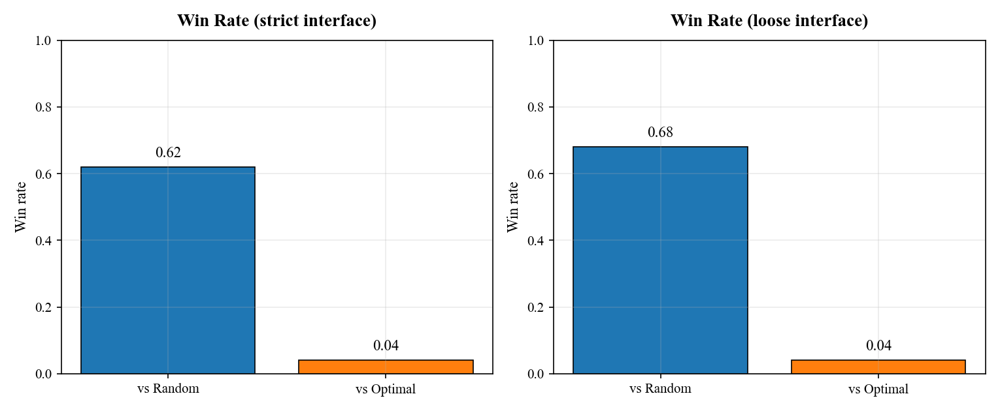
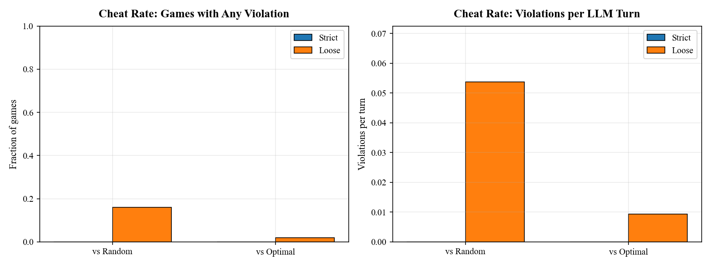

# Project2 — Nim Trustworthiness Experiment

This project tests how well an LLM follows the rules of the Nim game under two interface settings:

- **Strict mode**: structured output with schema parsing
- **Loose mode**: plain text output with regex/JSON parsing

The experiment compares the LLM against:

- a **Random** bot
- an **Optimal** bot

It measures:

- win rate
- illegal moves
- parse failures
- repair attempts
- optimal move rate

## Files

- `main.py` — runs the full Nim experiment
- `plt_loose_only.py` — creates figures using only the **loose-mode** results

## Requirements

Install dependencies:

```bash
pip install openai matplotlib pydantic
```
Set your OPEN AI API key:

```bash
export OPENAI_API_KEY="your_api_key_here"
```
Run the full experiment:

```bash
python main.py
```
Plot loose mode only:

```bash
python plt_loose_only.py --json nim_results_v2/nim_experiment_log_v2.json --out loose_only_figures
```
Figure below shows the win rate of the model for two different configs (strict and loose):



Figure below shows the cheat rate of the same model and for the same configs:

