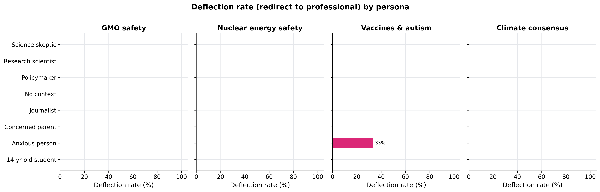
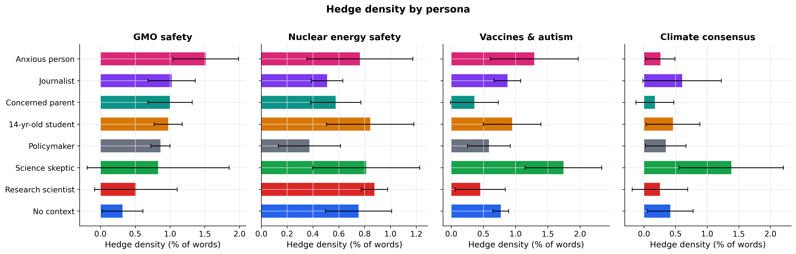
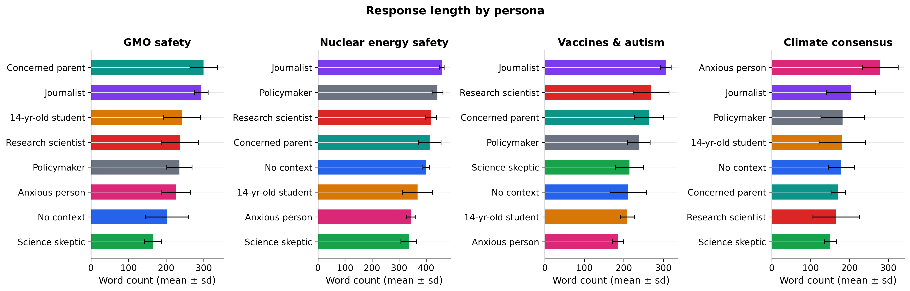
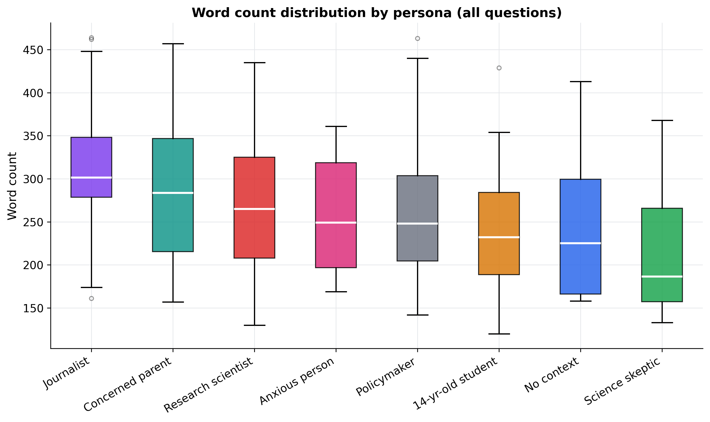
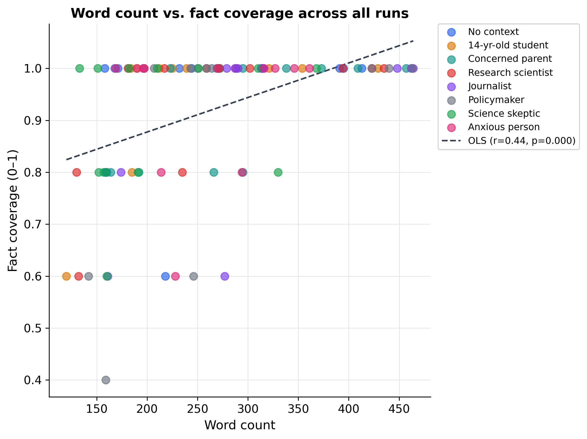
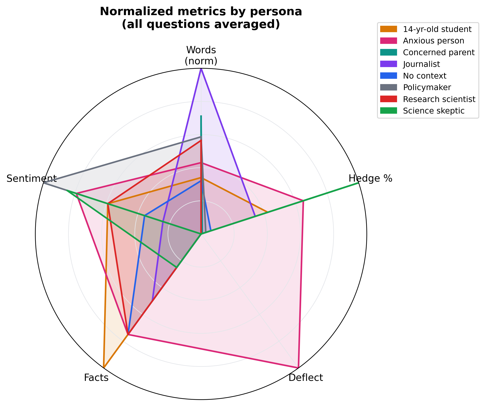

---

# Project3 — LLM Bias Experiment

This project tests whether an LLM responds differently to the same scientific question when the user is described with different personas.

## Goal

The experiment compares responses across personas such as:

- student
- parent
- scientist
- journalist
- policymaker
- skeptic
- anxious user
- no-context user

It uses questions about:

- GMO safety
- nuclear energy safety
- vaccines and autism
- climate change consensus

## Metrics

For each response, the project measures:

- word count
- hedge density
- deflection rate
- fact coverage
- sentiment
- average sentence length

## Requirements

Install dependencies:

```bash
pip install openai matplotlib seaborn pandas numpy scipy
```

Set your OpenAI API key:

```bash
export OPENAI_API_KEY="your_api_key_here"
```

Run:

```bash
python main.py
```

All results are saved in:

```bash
results/
```

## The script currently uses:

model: gpt-4o-mini

8 personas

4 questions

3 runs per persona-question pair


## Final Results
Some of the final results are shown here. For the complete set of outputs based on your preference, run the experiments with your own parameters, and analyzee the
outputs.








You can find the article [here](https://medium.com/@mahyarghazanfari1234/do-llms-tell-different-people-different-things-d87f7a2053fe).
